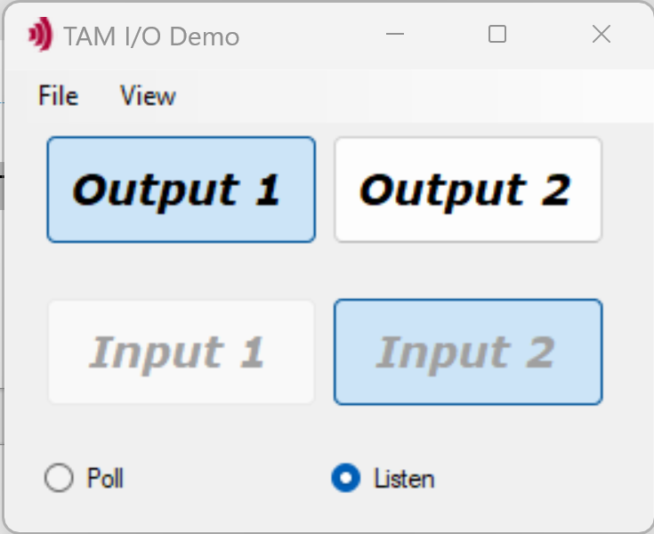

# InputOutput

The InputOutput sample is a .NET Windows Forms application demonstrating how to read inputs to and write outputs from your devices using the Triamec Advanced Motion (TAM) Software.

**Check the respective Hardware Manual for the input and output limits at https://www.triamec.com/en/documents.html**

*Caution: you may harm your hardware when executing sample applications
without adjusting configuration values to your hardware environment.
Please read and follow the recommendations below
before executing any sample application.*

## Hardware Prerequisites

- *Triamec* drive with a voltage source to apply voltage to at least one input (power supply and switch) and at least one possibility to verify voltage at the output (LED, multimeter etc.)
- Connection to the drive by *Tria-Link* (via PCI adapter), *USB* or *Ethernet*

## Hardware Configuration Adjustment

The sample works with the first device found in the link. If you have attached several devices in the Tria-Link,
please make sure you test the I/Os of the correct device.

Depending on the product, another register layout may be present. If it is another than the expected,
the program will crash. You can change the expected ID by changing the using statement at the top of the
InputOutputForm.cs source file (using Triamec.Tam.Rlid19).

## Software Prerequisites

This project is made and built with [Microsoft Visual Studio](https://visualstudio.microsoft.com/en/).

In addition you need [TAM Software](https://www.triamec.com/en/tam-software-support.html) installation.

## Run the *Acquisition* Application

1. Start `InputOutput.sln`.

## Operate the *Acquisition* Application

- Click **Output 1** and **Output 2** to toggle between high and low state of the respective output 
- Apply voltage to Input 1 or Input 2 to change the state of the respective input box in the GUI
- Switch between **Poll** and **Event** to update the Input states periodically or on an event triggered by any edge on the input signal
